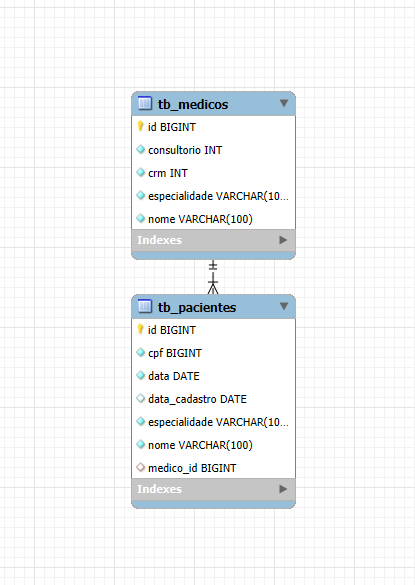

# Clínica Médica Gen - Sistema de Gerenciamento de Pacientes e Médicos

Projeto desenvolvido como parte do Desafio 1 do Projeto Integrador (Backend), com foco em criar uma aplicação funcional para auxiliar no gerenciamento de pacientes e médicos em clínicas de pequeno porte.

## 🏥 Descrição do Projeto

A Clínica Médica Gen é um sistema simples e eficiente de cadastro, consulta, atualização e exclusão de informações de **pacientes** e **médicos**. Voltado para o uso interno de clínicas, o objetivo é substituir métodos manuais de organização por uma solução digital ágil e segura.

### 🎯 Objetivo

Automatizar o gerenciamento de dados básicos em clínicas médicas, melhorando a organização do ambiente de trabalho, reduzindo erros e aumentando a eficiência no atendimento.

## 👥 Público-alvo

Secretárias, recepcionistas, médicos e administradores de clínicas que buscam uma solução prática para gerenciar seus cadastros.

## ❗ Problema que o projeto visa resolver:

Muitas clínicas ainda utilizam fichas físicas ou planilhas para armazenar dados, o que pode resultar em atrasos, perda de informações e retrabalho. Este sistema busca solucionar esse problema com uma interface simples e funcional.

## 🗃️ Entidades e Atributos

### Banco de dados (`db_clinicamedica`)

### Paciente (`tb_paciente`)
- `id`: Identificador único
- `nome`: Nome completo
- `data`: Data de nascimento
- `cpf`: Número do CPF
- `especialidade`: Consulta de que vai passar. Ex: Cardiologista, Pediatra 
- `data_cadastro`: Data de registro no sistema

### Médico (`tb_medico`)
- `id`: Identificador único
- `nome`: Nome completo
- `especialidade`: Ex: Cardiologia, Pediatria
- `crm`: Registro profissional
- `consultorio`: Número ou nome da sala de atendimento

## 🔧 Funcionalidades (CRUD)

### Paciente
- **Criar**: Cadastrar novo paciente
- **Listar**: Visualizar todos os pacientes (filtro por ID)
- **Atualizar**: Editar informações de um paciente
- **Excluir**: Remover cadastro

### Médico
- **Criar**: Cadastrar novo médico
- **Listar**: Visualizar todos os médicos (busca por especialidade)
- **Atualizar**: Alterar informações de um médico
- **Excluir**: Deletar registro

## 💻 Tecnologias Utilizadas

| Tecnologia      | Descrição                                           |
|-----------------|-----------------------------------------------------|
| Java            | Linguagem principal do backend                      |
| Spring Boot     | Framework para desenvolvimento web                  |
| MySQL           | Banco de dados relacional                           |
| JPA/Hibernate   | ORM para mapeamento objeto-relacional               |
| Maven           | Gerenciador de dependências                         |
| Insomnia        | Testes de endpoints RESTful                         |
| Trello          | Organização e gerenciamento das tarefas do projeto  |

## 🧪 Testes

As funcionalidades da API foram testadas utilizando o **Insomnia**, simulando requisições HTTP para validação de cada endpoint.

## 👨‍💻 Integrantes do Grupo

| Nome              | Função         | GitHub                                   |
|-------------------|----------------|-------------------------------------------|
| Camila Lima       | Desenvolvedora | [camilalimas](https://github.com/camilalimas)|
| João Andrade      | Desenvolvedor  | [JoaoAndrade-dev](https://github.com/JoaoAndrade-dev)|
| Karina Camargo    | Tester         | [araujokahh](https://github.com/araujokahh)|
| Luan Lazarine     | Desenvolvedor  | [Lazarine1996](https://github.com/Lazarine1996)|
| Pamela Oliveira   | Product Owner  | [heypamela](https://github.com/heypamela)|
| Vitor Teles       | Desenvolvedor  | [VitorGabrielTeles](https://github.com/VitorGabrielTeles)|

📅 Projeto iniciado em: **17/04/2025**

---

## 📌 Observações

Este projeto é voltado para fins educacionais e representa uma solução inicial que pode ser expandida com autenticação, agendamentos, relatórios e integração com frontend no futuro.

---

